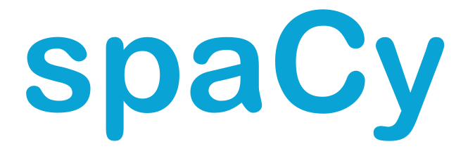
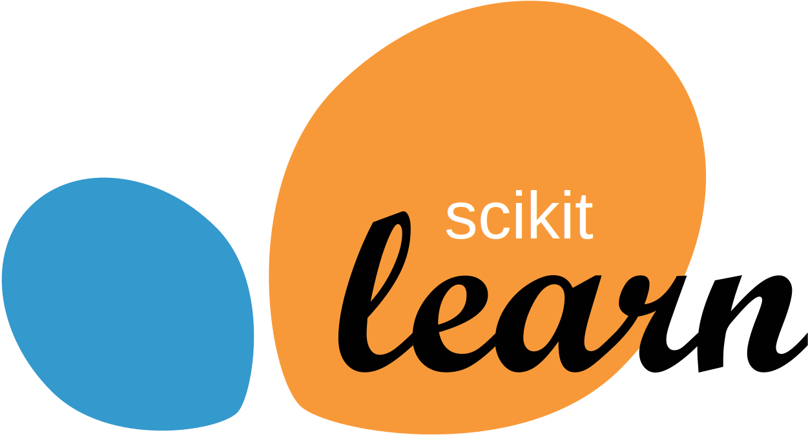

### Hi there 👋

I am Raj Jani. I am a Data Scientist at Ecom Express Ltd.

- 🔭 I’m currently working on various NLP projects such as **Text Classification**, and **Named Entity Recognition**, as well as a few **ComputerVision** projects.
- 🌱 I’m currently learning [**Mojo🔥**](https://www.modular.com/mojo).
- 📫 Reach me at **raj.jani189@gmail.com**
- 💬 Ask me about **Named Entity Recognition, Applied Statistics**.
- 🤝🏼 I’m looking to collaborate on **LLM based projects**.

 
<h3 align="left">Connect with me:</h3>

<h3 align="left">Languages and ML Frameworks:</h3>

 
 

 
 
 

 

 

<!--
**rajjanicodes/rajjanicodes** is a ✨ _special_ ✨ repository because its `README.md` (this file) appears on your GitHub profile.

Here are some ideas to get you started:

- 🔭 I’m currently working on various NLP projects such as Text Classification and Named Entity Recognition and ComputerVision projects.
- 🌱 I’m currently learning PyTorch and Mojo.
- 👯 I’m looking to collaborate on ...
- 🤔 I’m looking for help with ...
- 💬 Ask me about ...
- 📫 How to reach me: ...
- 😄 Pronouns: ...
- ⚡ Fun fact: ...
-->
